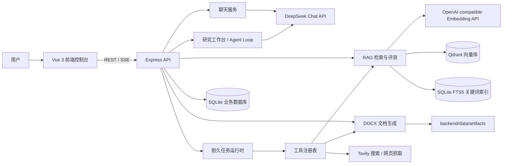
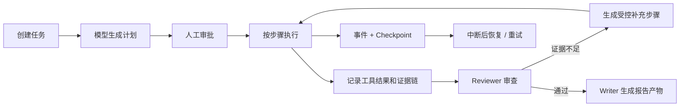

# EvidentLoop 项目技术与功能说明

> 项目路径：`D:\llmfile\evident-loop`
> 分析方式：基于 README、依赖清单、前后端源码、运行配置和测试文件的静态代码阅读。
> 项目版本：`0.1.0`（开发中）
> 项目定位：一个以“证据优先”为核心的、可恢复、可审计、可评测的研究型 AI Agent。

## 1. 项目概览

EvidentLoop 不是普通的聊天机器人项目。它希望解决研究型 Agent 在真实任务中常见的几个问题：任务中断后如何继续、工具执行后如何避免重复调用、结论如何追溯到证据、证据不足如何补充检索，以及 RAG 改动如何客观评估。

项目采用前后端分离架构：Vue 前端提供多个工作台；Express 后端负责对话、研究任务、RAG、文档和任务状态管理；SQLite 保存业务状态；Qdrant 保存知识库向量。大模型默认接入 DeepSeek，Embedding 接口采用兼容 OpenAI Embeddings 协议的服务（示例配置为 SiliconFlow 的 Qwen3 Embedding）。

核心理念是把约束放进运行时代码，而不仅是写进 Prompt：例如显式状态机、步骤审批、检查点、工具执行记录、重试、证据链和检索置信度判断。

## 2. 总体架构



### 数据与职责分层

| 层级 | 主要目录/组件 | 职责 |
| --- | --- | --- |
| 前端 | `frontend/` | 对话、研究过程、任务控制、知识库编辑、评测结果与设置的可视化界面 |
| API 层 | `backend/src/routes/` | 提供 REST 接口与 SSE 实时事件流 |
| Agent 层 | `backend/src/agent/` | DeepSeek Function Calling 循环、工具调度、异常与重复调用处理 |
| 任务运行时 | `backend/src/runtime/` | 任务计划、审批、状态机、Checkpoint、证据链、Review 和报告产物 |
| RAG 层 | `backend/src/rag/` | Markdown 解析、分块、向量化、混合检索、查询改写、置信度、离线评测 |
| 工具层 | `backend/src/tools/` | 知识库/文档检索、联网搜索、网页读取、Word 生成等工具注册和执行 |
| 存储层 | SQLite、Qdrant、文件系统 | 关系数据、向量数据、生成的 DOCX 文件 |

## 3. 使用的技术

### 3.1 前端技术栈

| 技术 | 用途 |
| --- | --- |
| Vue 3.5 | 单页应用与组件化界面开发，使用 Composition API |
| TypeScript 5.7 | 前端类型约束、API 数据结构与组件开发 |
| Vite 6 | 本地开发服务器和生产构建 |
| Vue Router 4 | SPA 路由基础设施；当前主路由为 `/`，工作区由页面内 Tab 切换 |
| Tailwind CSS 3 + PostCSS + Autoprefixer | 原子化样式、响应式布局和浏览器兼容前缀 |
| Phosphor Icons | 图标组件 |
| marked + DOMPurify | Markdown 渲染与 HTML 净化，降低展示模型输出时的 XSS 风险 |
| docx-preview | 浏览器端预览后端生成的 Word 文档 |
| EventSource/Fetch 流式读取 | 接收聊天、研究任务和评测过程的 SSE 实时事件 |

前端的主要页面组件包括：`ChatView`、`ResearchWorkbench`、`TaskConsoleView`、`RagEvaluationView`、`KnowledgeBasePanel` 和 `SettingsView`。研究界面还实现了可伸缩/可折叠侧栏、时间线、来源面板、笔记、Prompt 预览和 Word 产物预览。

### 3.2 后端技术栈

| 技术 | 用途 |
| --- | --- |
| Node.js 20+ | 后端 JavaScript 运行时 |
| TypeScript 5.7 | 服务端类型安全与构建 |
| Express 4 | HTTP API、路由、中间件 |
| CORS | 开发环境跨域支持 |
| dotenv | 从 `backend/.env` 读取模型、Embedding、Qdrant 等配置 |
| Zod 4 | 工具/文档参数的运行时校验（尤其用于 Word 文档 Schema） |
| tsx | TypeScript 的开发期运行、监听和测试执行 |
| Node 原生 `fetch`、`AbortController` | 调用外部模型/搜索服务、超时和取消控制 |

后端启动顺序为：初始化 SQLite 表结构 → 将异常中断的研究运行标记为失败 → 检查 Qdrant 连接/集合 → 清理过期文档产物 → 启动 Express 服务。

### 3.3 数据存储与检索

| 技术 | 用途 |
| --- | --- |
| SQLite（`better-sqlite3`） | 本地关系型持久化：会话、消息、研究运行、任务、计划、证据、评测记录等 |
| Drizzle ORM | SQLite 访问封装依赖已引入；当前初始化与不少数据操作采用 SQLite/SQL 方式实现 |
| SQLite FTS5 | Markdown 内容的全文关键词索引，用于混合检索中的关键词召回 |
| Qdrant 1.13.6 | 向量数据库，保存 Markdown Chunk 的 embedding 与元数据 |
| `@qdrant/js-client-rest` | Qdrant REST 客户端 |
| Docker Compose | 一键启动本地 Qdrant，并使用 Docker Volume 持久化数据 |
| 文件系统 | 知识库 Markdown、生成的 DOCX artifact 和本地 SQLite 数据文件 |

Qdrant Collection 默认名称为 `knowledge_chunks`，采用 Cosine（余弦相似度）距离。向量条目带有文件名、标题、标题路径、行号、Chunk 前后关系、内容哈希、文档哈希、Embedding 模型和索引时间等元数据。

### 3.4 AI 与外部服务

| 服务/协议 | 用途 |
| --- | --- |
| DeepSeek Chat Completions | 普通流式聊天、研究工作台的 Function Calling Agent Loop、计划与查询改写 |
| OpenAI-compatible Embeddings API | 为 Markdown Chunk 和查询生成向量；示例配置为 SiliconFlow + `Qwen/Qwen3-Embedding-4B` |
| Tavily Search API | 可选的公网搜索工具，需配置 `TAVILY_API_KEY` |
| HTTP 网页抓取 | Agent 可在搜索后读取公共网页的相关文本片段 |
| `docx` | 服务端生成 `.docx` 文件 |

## 4. 核心功能

### 4.1 普通 AI 对话

- 支持创建、查看和删除本地会话；会话及消息存储在 SQLite。
- 向 DeepSeek 发起流式请求，前端通过 SSE 逐步展示回答。
- 能接收并展示模型的推理字段（`reasoning_content`）和正文增量。
- 支持请求超时、浏览器断连取消，以及失败状态的消息落库。
- 首条消息会自动生成会话标题。

该功能偏向常规对话，和“研究工作台”的工具调用与来源追踪能力是两条独立流程。

### 4.2 研究工作台（Research Workbench）

研究工作台面向需要检索、引用和过程可见性的多步骤问答。其执行特点包括：

- 每次研究请求会创建用户消息、助手消息和独立的 `research_run`。
- 后端以 SSE 持续推送模型调用、工具开始/完成、发现来源、回答增量、运行状态等事件。
- 页面可展示研究时间线、来源列表、步骤详情、笔记、上下文/记忆和 Prompt 预览。
- 支持后台继续运行：前端连接断开时，研究流程并不必然停止；用户可重新订阅运行状态。
- 支持用户显式取消运行。
- 可以按工具开关限制本轮研究可调用的工具。
- 对同一研究请求中“工具名 + 参数”完全相同的搜索/抓取调用做去重，避免重复搜索。
- 工具轮次默认受限（默认最多 4 轮），单个工具结果写回模型上下文时也有字符预算，防止上下文无限膨胀。

### 4.3 Function Calling Agent Loop

Agent Loop 位于 `backend/src/agent/agentLoop.ts`，使用模型的结构化工具调用，而不是让模型在纯文本中模拟调用。主要机制：

1. 组装 system prompt、历史消息和当前问题。
2. 根据允许工具集向 DeepSeek 提交 Function Calling 定义。
3. 解析模型返回的工具调用，执行已注册工具，并把结果作为 `tool` 消息回传模型。
4. 继续循环，直到模型生成最终回答或达到工具轮次限制。
5. 从知识库检索工具结果提取可展示的来源。

为了提升容错性，代码还实现了：

- 检测模型把原生工具调用标记误输出到正文的情况，并要求重试一次；
- 需要生成 Word 时，检测未调用或参数无效，要求模型修正一次；
- 对工具调用 JSON 解析错误记录为工具轨迹，而不是直接使整个流程崩溃；
- `AbortSignal` 贯穿模型请求和工具请求，支持取消。

### 4.4 Durable Runtime：可审计任务运行时

任务控制台实现的是比研究工作台更严格的“计划—审批—执行—审查—产物”流程：



已实现或有明确代码支撑的能力：

- 创建任务时设置目标、最大步骤数、最大 Token 约束和允许工具。
- 使用显式状态机控制 `created`、`planning`、`awaiting_approval`、`running`、`paused`、`completed`、`failed`、`cancelled` 等状态转换。
- 计划步骤保存目标、依赖、期望证据、尝试次数、输入/输出和错误。
- 审批后才能执行计划。
- 每次关键状态变化追加事件，并保存带版本号的 Checkpoint。
- 记录工具执行的唯一 `execution_key`、参数、结果、错误和时间，支持幂等复用与可追踪。
- 支持步骤重试。
- 将来源（Source）、证据（Evidence）、主张（Claim）及其支持/矛盾/上下文关系持久化。
- Reviewer 可记录已支持/未支持主张、限制和证据缺口；对缺口创建补充检索步骤。
- Writer 可生成最终报告 artifact。

### 4.5 证据链（Source → Evidence → Claim）

这是本项目最有辨识度的设计。系统不只保存最终文本，还拆开保存：

- **Source**：来源，如知识库文档、外部网页、工具结果；
- **Evidence**：从来源抽取的具体内容、定位信息和相关度；
- **Claim**：任务中形成的结论或主张；
- **Link**：主张和证据之间的 `supports`、`contradicts` 或 `context` 关系。

这样可以对每一条结论回答“它根据什么得出”，也可以发现没有证据支持的内容。证据链数据在 SQLite 的 `agent_sources`、`agent_evidence`、`agent_claims`、`agent_claim_evidence` 等表中保存。

### 4.6 Markdown 知识库管理

知识库以 Markdown 文件为主，前端有独立知识库面板，后端提供文件管理接口。功能包括：

- 列出知识库文件、文件大小、行数、Chunk 数量、索引状态和索引模型；
- 查看文档全文；
- 新建、修改、删除 Markdown 文档；
- 可选择保存后自动向量化；
- 查看文档被切分后的 Chunk、标题路径、行号、Token 数和前后关联；
- 单文件向量化或全量同步索引；
- 文件删除时可同步清理 Qdrant 向量和 FTS5 关键词索引。

源码中的路径校验会把文档限制在固定知识库目录中，避免通过请求参数任意访问服务器文件。

### 4.7 RAG 检索链路

知识库检索入口为 `retrieveKnowledge`，支持两种模式：

| 模式 | 检索策略 |
| --- | --- |
| Dense | 查询向量 → Qdrant Top 候选 → 相邻 Chunk 合并 → 返回结果 |
| Hybrid（默认可配置） | Qdrant Dense Top20 + SQLite FTS5 Keyword Top20 → RRF 融合 → 相邻 Chunk 合并 → 限制同文档结果数 → 截断返回 |

具体能力：

- Markdown 文档按标题和内容切块，保留行号、标题路径和相邻块关系；
- 以 SHA-256 内容哈希判断增量变化，只有变化的 Chunk 才重新生成 Embedding；
- 以批处理方式写入 Qdrant（每批 64 条）；
- 同时维护向量索引和 FTS5 关键词索引；
- 合并相邻片段以补足上下文；
- 使用 Reciprocal Rank Fusion（RRF）融合语义召回与关键词召回；
- 通过置信度判断输出 `sufficient`、`weak`、`empty` 等检索结论；
- 对弱检索（或临界的纯语义结果）可调用 DeepSeek 进行受预算约束的查询改写，最多形成 3 条总查询，再将原查询和改写查询结果融合；
- 空结果被视为“无证据”，避免模型把无关结果当作可引用内容。

### 4.8 RAG 评测

项目内置 RAG 评测模块与固定的评测语料/fixtures。支持：

- 创建异步评测任务；
- 配置 Top-K、阈值、检索模式和是否开启查询改写；
- 通过 SSE 查看运行进度和最终结果；
- 保存历史评测记录；
- 删除已结束的评测，运行中的评测不允许删除；
- 命令行执行完整评测与不依赖外部 Embedding 的 smoke 测试。

README 明确将 Recall@K、MRR 和拒答能力作为 RAG 质量指标。这个设计有助于避免“主观感觉检索变好了”但实际召回退化的问题。

### 4.9 Agent 工具体系

当前注册的工具如下：

| 工具名 | 功能 | 关键限制/说明 |
| --- | --- | --- |
| `search_knowledge` | 检索向量化 Markdown 知识库 | 最多返回 10 条；返回检索置信度、改写信息和来源 |
| `search_docs` | 在固定 `docs/` 目录中做关键词搜索 | 最多 20 条匹配 |
| `read_document` | 读取固定 `docs/` 目录下的 Markdown | 仅允许 docs 相对路径；内容默认/最多 12000 字符 |
| `web_search` | 通过 Tavily 搜索公网 | 需 API Key；默认 5 条、最多 8 条；15 秒超时 |
| `fetch_page` | 抓取公共网页并返回与查询相关的片段 | 用于搜索后的深读；返回片段数受限 |
| `generate_word_document` | 把 Markdown 渲染为 DOCX | 只有用户明确要求 Word/DOCX 时才应调用；支持模板和预览/下载 |

### 4.10 Word 文档生成

系统可以让 Agent 通过工具生成 Word 报告：

- 接收标题、副标题、作者及完整 Markdown 正文；
- 支持标题、段落、无序/有序列表、表格、代码块和分页标记；
- 支持 `research-report`、`technical-report`、`business-report`、`simple` 四种样式预设；
- 可配置 A4/Letter、横竖方向、边距、字体、字号、配色、页眉、页脚、页码；
- 生成文件保存为后端 artifact，提供下载和浏览器预览 URL；
- artifact 默认会过期清理，默认 TTL 为 24 小时。

## 5. 前端可见功能模块

| 工作区 | 用户可做什么 |
| --- | --- |
| 任务控制台 | 创建任务、设置步骤/Token/工具约束、生成计划、人工审批、执行、重试步骤、查看事件/证据/报告 |
| 对话 | 管理会话、发送 DeepSeek 流式聊天、阅读 Markdown 回复 |
| 研究工作台 | 开展带工具的研究、选择启用工具、查看时间线、来源、步骤详情、笔记和 Prompt 预览、停止运行、预览 Word 结果 |
| RAG 评测 | 发起评测、查看实时进度与历史评测结果 |
| 知识库 | 管理 Markdown 文档、编辑、查看 Chunk、向量化和全量同步 |
| 设置 | 配置各工作区 Tab 的显示与隐藏状态（本地保存） |

## 6. 主要后端 API 分类

后端统一挂载在 `/api` 下，主要路由模块包括：

| API 分类 | 典型路径 | 说明 |
| --- | --- | --- |
| 健康检查 | `/api/health` | 检查服务状态 |
| 聊天 | `/api/chat/conversations`、`.../messages/stream` | 会话 CRUD 与 SSE 流式聊天 |
| 研究 | `/api/research/...` | 研究会话、运行创建/取消、工具列表、进度订阅、笔记等 |
| 任务 | `/api/tasks`、`/:id/plan`、`/:id/approve`、`/:id/run`、`/:id/finalize` | Durable Runtime 的任务生命周期 |
| 知识库 | `/api/knowledge/documents`、`/chunk`、`/vectorize`、`/sync` | 文档管理、分块和索引 |
| RAG 评测 | `/api/rag/evaluations`、`/:id/events` | 创建、查询、删除与 SSE 进度 |
| Artifact | `/api/artifacts/...` | DOCX 文件预览与下载 |
| DeepSeek/DB 测试 | `deepseek`、`db-test` 路由 | 连通性/演示辅助接口 |

## 7. 数据模型概览

SQLite 初始化代码创建了以下主要数据组：

| 数据组 | 代表表 | 保存内容 |
| --- | --- | --- |
| 知识库 | `knowledge_documents` | 本地 Markdown 文档内容和更新时间 |
| 对话 | `chat_conversations`、`chat_messages` | 普通会话和消息状态 |
| 研究工作台 | `research_conversations`、`research_messages`、`research_runs`、`research_steps`、`research_sources`、`research_notes` | 研究过程、工具/模型步骤、引用来源和笔记 |
| RAG 评测 | `rag_evaluations` | 评测配置、状态、报告、错误、进度 |
| Agent 任务 | `agent_tasks`、`agent_plan_steps`、`agent_reviews`、`agent_evidence_gaps` | 任务目标、计划、审查和证据缺口 |
| 证据链 | `agent_sources`、`agent_evidence`、`agent_claims`、`agent_claim_evidence` | 来源、证据、主张和关系 |
| 可恢复执行 | `agent_events`、`agent_checkpoints`、`tool_executions` | 事件日志、版本化快照、工具幂等执行记录 |
| 产物 | `agent_artifacts` | 最终报告等已完成产物 |

## 8. 本地运行与开发方式

### 环境要求

- Node.js 20+
- pnpm 10+
- Docker 与 Docker Compose
- DeepSeek API Key
- 支持 OpenAI Embeddings 协议的 Embedding API Key
- 可选：Tavily API Key（启用公网搜索时需要）

### 基本启动

```bash
pnpm install
cp backend/.env.example backend/.env
pnpm qdrant:up
pnpm dev
```

默认访问地址：

- 前端：`http://localhost:5173`
- 后端健康检查：`http://localhost:3000/api/health`
- Qdrant Dashboard：`http://localhost:6333/dashboard`

### 主要命令

```bash
pnpm dev                 # 同时启动前后端
pnpm typecheck           # TypeScript 类型检查
pnpm test                # 后端自动化测试
pnpm build               # 前后端生产构建
pnpm qdrant:up           # 启动 Qdrant
pnpm qdrant:down         # 停止 Qdrant（保留卷数据）
pnpm rag:sync            # 同步/重建知识库索引
pnpm rag:eval            # 执行完整 RAG 评测
pnpm rag:eval:smoke      # 执行不依赖外部 Embedding 的冒烟评测
```

## 9. 已实现能力与当前局限

### 已具备的基础能力

- 多轮 Function Calling Agent Loop；
- 任务计划、人工审批、显式状态机和 Checkpoint；
- 工具执行记录、重复搜索去重、失败重试；
- Source → Evidence → Claim 证据链和 Reviewer 证据缺口；
- Markdown 知识库、Dense/Hybrid RAG、查询改写；
- RAG 评测与 SSE 实时状态；
- 可断线重连、可取消的研究工作台；
- Word 报告生成、预览、下载和过期清理。

### README 明确说明尚未完成或不适合生产使用的部分

- `maxTokens` 已进入任务约束，但尚未实现真实 Token 精确统计与强制预算控制；
- LLM Provider 与 Embedding Provider 的抽象仍可完善；
- API 暂无身份认证、用户隔离和限流，不能直接暴露到公网；
- `fetch_page` 等联网工具仍需要生产级 SSRF 防护加固；
- 前端自动化测试和端到端测试覆盖不足；
- 多实例任务锁、队列调度和完整 Run Replay 尚未实现；
- 根目录 `pnpm lint` 是预留入口，当前不能代替类型检查和测试。

## 10. 对项目的总结判断

EvidentLoop 的核心价值不在于“再做一个聊天界面”，而在于提供了一个研究型 Agent 的工程化样板：将模型调用、工具、任务状态、证据、审查、检索与评测分层管理。

它尤其适合以下场景：内部知识库问答、需要可追溯来源的调研、需要长期运行/可恢复的 Agent 任务、企业研究报告生成，以及 RAG 方案的实验和评测。

从成熟度看，该项目适合作为本地开发、架构学习和功能演示的基础；若要投入公网或多用户生产环境，还需要优先补齐认证授权、租户隔离、限流、外部 URL 安全策略、观测告警、队列/锁、预算治理和端到端测试。

## 11. 关键目录速览

```text
evident-loop/
├── frontend/                     # Vue 3 + Vite 前端
│   └── src/
│       ├── views/                # 六个工作区页面
│       ├── components/           # 聊天、研究、文档等组件
│       ├── api/                  # 后端 API/SSE 客户端
│       └── types/                # 前端 TypeScript 类型
├── backend/                      # Express + TypeScript 后端
│   └── src/
│       ├── agent/                # Function Calling Agent Loop
│       ├── runtime/              # 状态机、计划、证据链、审查、执行
│       ├── rag/                  # 分块、索引、混合检索、改写、评测
│       ├── tools/                # Agent 工具注册和实现
│       ├── research/             # 研究工作台后端服务
│       ├── chat/                 # 普通对话会话存储
│       ├── documents/            # DOCX Schema、预设、渲染
│       ├── artifacts/            # 生成文档文件管理
│       └── routes/               # Express 路由
├── docs/                         # 项目开发与内置知识文档
├── knowledge-samples/            # 可导入的示例 Markdown 知识库
├── docker-compose.yml            # Qdrant 本地容器
├── RUNNING.md                    # 运行指南
└── package.json                  # pnpm workspace 根配置
```

---

分析完成日期：2026-08-03
