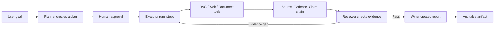

<div align="center">
  

  English · [简体中文](./README.zh-CN.md)
</div>

# EvidentLoop (Under Development)

An evidence-first durable research agent.

EvidentLoop is a recoverable, auditable, and evaluable agent for long-running research tasks.

The project is evolving quickly, and its APIs, data models, and interactions may change. Its current focus is not adding more chat features, but strengthening the durable runtime, Source–Evidence–Claim traceability, controlled retrieval, and reproducible evaluation.

Contributions through issues, pull requests, and design discussions are welcome. This README also serves as the project overview and contribution guide.

## Project Status

The current version is suitable for local development, architecture study, and demonstrations. It is not ready for public production deployment.

Implemented:

- Multi-turn function-calling agent loop
- Task planning, human approval, explicit state machine, and checkpoints
- Tool execution records, idempotent reuse, and failure retries
- Source–Evidence–Claim traceability
- Reviewer-driven evidence-gap detection with one controlled supplementary retrieval pass
- Multi-format knowledge base for Markdown, TXT, DOCX, and text-based PDF, with structure-aware chunking, page or source-line citations, Dense/Hybrid RAG, and query rewriting
- RAG evaluation with Recall@K, MRR, and abstention metrics
- Disconnect-resilient background research with explicit cancellation, a task console, and Word report generation
- Dynamic ToolRuntime snapshots and MCP connections for the Research Workbench and durable Agent Tasks, with Streamable HTTP/stdio, OAuth, persistent tool schemas, approval gates, and one-click managed presets

In progress or not yet implemented:

- `maxTokens` is part of task constraints, but real token accounting and hard budget enforcement are not complete
- LLM and embedding providers still need further decoupling
- The API has no authentication, user isolation, or rate limiting
- Network tools such as `fetch_page` still require production-grade SSRF hardening
- OCR for scanned PDFs, XLSX/CSV/PPTX import, and visual PDF layout reconstruction are not implemented
- Frontend automation and end-to-end test coverage remain limited
- Multi-instance task locking, queue scheduling, and full run replay are not implemented

Do not describe unfinished capabilities as implemented in articles, portfolios, or résumés.

## Core Workflow



The project follows several principles:

- Runtime constraints must be enforced by code, not only stated in prompts.
- When evidence is insufficient, the system should state the limitation instead of inventing sources.
- Retrieval changes should be validated against fixed evaluation sets rather than subjective impressions alone.
- Long-running tasks should retain state, events, and tool results so recovery can safely determine what may be reused.
- Keep the core implementation understandable before introducing large agent frameworks.

## Quick Start

Requirements:

- Node.js 20+
- pnpm 10+
- Docker and Docker Compose
- A DeepSeek or MiniMax API key
- An embedding API key for an OpenAI-compatible embeddings endpoint

```bash
pnpm install
cp backend/.env.example backend/.env
pnpm qdrant:up
pnpm dev
```

Before starting, edit `backend/.env`, select a text-model provider, and configure embeddings. DeepSeek example:

```dotenv
DEEPSEEK_API_KEY=your_deepseek_key
EMBEDDING_API_KEY=your_embedding_key
```

MiniMax example:

```dotenv
LLM_PROVIDER=minimax
MINIMAX_API_KEY=your_minimax_key
MINIMAX_MODEL=MiniMax-M3
MINIMAX_BASE_URL=https://api.minimaxi.com/v1
EMBEDDING_API_KEY=your_embedding_key
```

To use web search tools, also configure:

```dotenv
TAVILY_API_KEY=your_tavily_key
```

### MCP connections

The MCP management page provides **one-click enablement** for built-in presets (Context7 and Memory) with cross-platform support and fixed package versions. Custom MCP servers can still be configured manually from **Settings → MCP Servers**.

Built-in presets:
- **Context7**: Query latest library and framework documentation
- **Memory**: Persistent local knowledge graph for MCP clients

For manual connections, new servers are saved disabled; test the connection and tool list before enabling it. The UI supports local `stdio` servers and MCP Streamable HTTP with static headers or OAuth. See the [dynamic tools and MCP guide](./docs/development/dynamic-tools-and-mcp.md) for lifecycle, approval, API, and security details.

The local deployment boundary is configured in `backend/.env`:

```dotenv
HOST=127.0.0.1
APP_ORIGINS=http://localhost:5173,http://127.0.0.1:5173
MCP_CREDENTIALS_KEY=<32-byte-base64-secret>
MCP_OAUTH_REDIRECT_URI=
```

`MCP_CREDENTIALS_KEY` is required to save MCP environment variables, static headers, or OAuth state. It must be a Base64-encoded 32-byte key; generate one locally and never commit it. `MCP_OAUTH_REDIRECT_URI` is optional and defaults to the loopback callback under the configured `PORT`. `stdio` MCP is allowed only when `HOST` is loopback. Keep `HOST` and `APP_ORIGINS` restricted to trusted local origins when developing.

Local endpoints:

- Frontend: http://localhost:5173
- Backend health check: http://localhost:3000/api/health
- Qdrant dashboard: http://localhost:6333/dashboard

After the first launch, upload files from the **Knowledge Base** screen and leave **Automatically vectorize after saving** enabled. Supported formats are `.md`, `.txt`, `.docx`, and text-based `.pdf`. Markdown samples remain available in `knowledge-samples/`. Imported PDF and DOCX files are read-only, but their originals can be downloaded or reparsed. Scanned PDFs and PDFs without extractable text are rejected rather than stored as empty documents.

See the [running guide](./RUNNING.md) for complete environment configuration, first-run setup, acceptance checks, and troubleshooting. The guide is currently written in Chinese.

## Project Structure

```text
.
├── frontend/                   # Vue 3 + Vite + TypeScript
├── backend/                    # Express + TypeScript + SQLite
│   └── src/
│       ├── modules/            # Application-layer module APIs and boundaries
│       ├── llm/                # LLM provider port and adapters
│       ├── agent/              # Function-calling agent loop
│       ├── runtime/            # State machine, checkpoints, evidence chain, task execution
│       ├── knowledge/          # Multi-format import, parsers, originals, source locators
│       ├── rag/                # Chunking, retrieval, fusion, rewriting, evaluation
│       ├── tools/              # Tool contracts, capability catalogs, composition
│       └── documents/          # Word document schema and rendering
├── docs/knowledge/             # Built-in evaluation and demo documents
├── knowledge-samples/          # Importable knowledge-base samples
├── docker-compose.yml          # Local Qdrant service
└── RUNNING.md                  # Full running guide (Chinese)
```

See the [modular architecture conventions](./docs/development/modular-architecture.md) for backend dependency direction and guidelines for adding providers and tools. This document is currently written in Chinese.

## Contributing

### Good Contribution Areas

Contributions are especially welcome in the following areas:

| Area | Examples |
| --- | --- |
| Runtime | Token/cost/time budgets, recovery semantics, concurrent task locking, run replay |
| Agent Loop | Context management, error recovery, tool-call protocol compatibility, streaming events |
| RAG | Rerankers, retrieval evaluation cases, confidence calibration, query fusion |
| Providers | LLM providers, embedding providers, compatible API adapters |
| Tool Safety | Zod validation, permission policies, timeouts, SSRF protection |
| Frontend | Task observability, evidence-chain display, error feedback, end-to-end tests |
| Documentation | Architecture explanations, reproducible experiments, English docs, troubleshooting |

For a first contribution, documentation, tests, configuration validation, and small UI issues are good starting points. For significant changes to runtime state, database schemas, tool permissions, or provider abstractions, open an issue to discuss the design first.

### Development Workflow

1. Fork the repository and create a feature branch from the latest main branch.
2. Describe the problem, expected behavior, and verification approach in an issue.
3. Keep each pull request focused on one subject.
4. Add or update tests together with implementation changes.
5. Update the README or `RUNNING.md` when configuration, APIs, or user workflows change.
6. In the pull request, explain the change, design tradeoffs, verification results, and known limitations.

Small fixes may be submitted directly. Discuss architectural changes first to avoid investing heavily in a direction that does not fit the project.

### Local Verification

Run at least the following before submitting:

```bash
pnpm typecheck
pnpm test
pnpm --filter backend runtime:verify
pnpm build
```

For dependency changes, also run:

```bash
pnpm install --frozen-lockfile
pnpm audit --registry=https://registry.npmjs.org/ --prod
```

The root `pnpm lint` command is currently a placeholder and is not a substitute for type checking and tests.

### Pull Request Checklist

- [ ] The change has a clear goal and contains no unrelated refactoring
- [ ] TypeScript type checking passes
- [ ] Existing automated tests pass
- [ ] New behavior has tests, or the PR explains why it cannot be tested automatically
- [ ] Frontend changes include screenshots or a recording
- [ ] Documentation is updated for configuration, API, or workflow changes
- [ ] No `.env`, API keys, databases, generated files, or personal IDE configuration are committed
- [ ] Unimplemented or unevaluated capabilities are not described as complete
- [ ] Compatibility impact, migrations, and known limitations are documented

## Issue Template Guidance

To make issues easier to reproduce and pick up, include:

- Background and use case
- Current and expected behavior
- Minimal reproduction steps
- Node.js, pnpm, operating system, and related service versions
- Logs or screenshots with secrets and personal data removed
- For feature proposals, why the capability belongs in the project core rather than a business-specific extension

You can prefix issue titles with module labels such as `[Runtime]`, `[RAG]`, `[Frontend]`, `[Tool]`, or `[Docs]`.

## Data and Security

- SQLite data, conversations, tasks, and generated documents are stored under `backend/data/` by default.
- Imported knowledge-base originals are stored under `backend/data/knowledge-files/` by default.
- Qdrant stores derived vectors and source metadata in a local Docker volume.
- Never commit `.env` files, databases, build artifacts, or local configuration.
- Example configuration files must contain only empty or invalid placeholder values.
- The API currently has no authentication or rate limiting. Do not expose the development server directly to the public internet.
- MCP configuration and credentials are currently instance-wide, not user- or tenant-scoped. A multi-user production deployment still requires external authentication, tenant isolation, and credential/policy boundaries; these are not implemented here.
- Before sharing logs, screenshots, or issues, check for conversations, document content, tokens, and internal addresses.

## Common Commands

```bash
pnpm dev                 # Start frontend and backend
pnpm typecheck           # TypeScript checks
pnpm test                # Automated tests
pnpm build               # Production build checks
pnpm qdrant:up           # Start Qdrant
pnpm qdrant:down         # Stop Qdrant and keep its volume
pnpm rag:sync            # Rebuild or synchronize the knowledge index
pnpm rag:eval            # Run evaluation through the real retrieval pipeline
pnpm rag:eval:smoke      # Run the smoke evaluation without external embeddings
```

## Project Goals

Rather than maximizing feature count as quickly as possible, EvidentLoop aims to become a reference implementation that can answer:

- After an agent is interrupted, how does the system know where to resume?
- If a tool succeeded but the request disconnected, how can duplicate execution be avoided?
- How can a claim be traced to a specific source and piece of evidence?
- When the reviewer finds insufficient evidence, how can supplementary retrieval remain budgeted and controlled?
- How can fixed datasets prove that a RAG optimization did not regress quality?
- Where should responsibilities sit between the model, tools, and runtime?

If a contribution makes these questions clearer, more reliable, or easier to reproduce, it is a strong fit for the project.

## License

EvidentLoop is licensed under the [Apache License 2.0](./LICENSE).
