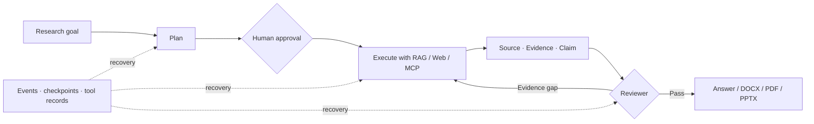

<div align="center">
  

  <h1>EvidentLoop</h1>

  <p><strong>Research answers are easy. Auditable research systems are hard.</strong></p>
  <p>An evidence-first, durable research workspace that turns open-ended questions into traceable conclusions and polished deliverables.</p>

  <p>
    
    
    
    
    <a href="./LICENSE"></a>
  </p>

  <p><strong>English</strong> · <a href="./README.zh-CN.md">简体中文</a></p>
</div>

---

EvidentLoop is not another chat wrapper. It is a full-stack exploration of what an AI research system needs after the first impressive demo: durable execution, explicit evidence, controlled tools, measurable retrieval, and outputs people can actually use.

## Why it stands out

| | Capability | What it changes |
| :---: | --- | --- |
| ↻ | **Durable agent runtime** | Explicit states, checkpoints, idempotent tool reuse, retries, cancellation, and resumable SSE keep long-running work recoverable. |
| ⛓ | **Source → Evidence → Claim** | Every conclusion can be linked to the exact source passage that supports, contradicts, or contextualizes it. |
| ◎ | **Retrieval you can measure** | Dense/Hybrid RAG, confidence-aware query rewriting, abstention cases, saved baselines, and per-case regression analysis replace “feels better” tuning. |
| ◈ | **Tools with hard boundaries** | Immutable runtime snapshots, schema hashes, policy filtering, availability checks, approval gates, and MCP isolation enforce permissions in code. |
| ✦ | **Research becomes a deliverable** | One editable, versioned workflow produces cited DOCX, PDF, and PPTX files, with rendering inspection, retry, preview, and a cross-conversation library. |

## From question to auditable artifact



The loop is deliberately explicit: the planner defines expected evidence, tools execute within a frozen permission snapshot, the reviewer identifies unsupported claims, and only then does the writer produce the final result. Runtime constraints live in code—not only in prompts.

## Product surfaces

### Research Workbench

A streaming, multi-turn workspace for evidence-backed investigation. It combines conversation history, a live execution timeline, source inspection, notes, tool approvals, official research skills, and context-compression visibility. Research continues in the background and reconnects after browser interruptions.

### Durable Agent Tasks

For longer jobs, EvidentLoop exposes the complete execution lifecycle: planning, approval, step dependencies, attempts, reviews, evidence gaps, checkpoints, cancellation, and the final report. Completed tool calls are stored with stable execution keys so recovery can reuse work safely instead of repeating side effects.

### Knowledge & RAG Lab

- Imports Markdown, TXT, DOCX, and text-based PDF while preserving headings, page numbers, or source-line locators.
- Runs Dense or Hybrid retrieval with FTS5 + Qdrant, reciprocal-rank fusion, adjacent-chunk assembly, confidence classification, and bounded query rewriting.
- Evaluates the production retrieval path with file-, section-, and evidence-level Recall@3 / MRR@3, answerable and abstention cases, historical baselines, and per-query flips.

### Controlled Web Evidence

Web retrieval is a budgeted evidence pipeline rather than a raw search call. It detects intent, prefers authoritative domains when appropriate, rewrites weak queries, scores page quality, diversifies domains, measures claim coverage, and stops once the evidence requirement is met—or reports that it is not.

### Dynamic Tools & MCP

Built-in and MCP tools share one neutral runtime contract. Each model turn receives an immutable tool snapshot; execution rechecks authorization, current availability, definition hashes, and input schemas. Streamable HTTP, local stdio, static headers, OAuth, persisted schemas, explicit approval gates, and managed presets are supported without leaking MCP concerns into the research domain.

### Artifact Workbench

Research output can become a presentation or long-form document through a single lifecycle: create a draft, edit, autosave, confirm formats, freeze an immutable version, render, inspect, repair, preview, and download. DOCX and PDF share one long-form source; PPTX uses a presentation-specific model while retaining the same citations and research snapshot.

## Quality, measured

> **119 golden questions** · **97.2% file-level Recall@3** · **78 test files**

Retrieval changes are checked against a fixed corpus instead of judged by impression. The evaluation covers 109 answerable and 10 deliberately unanswerable questions, measures results at file, section, and evidence level, and records historical baselines for regression analysis. The wider test suite covers runtime recovery, evidence construction, tool safety, MCP lifecycle, streaming resume, and document generation.

These numbers describe the checked-in corpus and configuration—not universal model quality. See the [evaluation methodology](./docs/development/rag-evaluation.md) for the fixtures and comparison process.

## Architecture

```text
Vue 3 workspace
  ├─ Research workbench     ├─ Durable task console
  ├─ Knowledge & eval lab   ├─ Artifact library
  └─ MCP management        └─ Settings
               │ HTTP + resumable SSE
               ▼
Express application adapters
               ▼
Module application APIs
  ├─ Research     ├─ Tasks       └─ Artifacts
               ▼
Domain services and ports
  ├─ Agent loop   ├─ Durable runtime  ├─ Context
  ├─ RAG / Web    ├─ Evidence chain   ├─ ToolRuntime
  └─ Skills       └─ Document model   └─ Approvals
               ▼
Infrastructure adapters
  ├─ SQLite / Drizzle  ├─ Qdrant / FTS5
  ├─ LLM providers     ├─ MCP SDK
  └─ DOCX / PDF / PPTX renderers
```

The backend is a modular monolith with one production composition root. Routes handle protocol concerns, modules expose application use cases, domain code depends on neutral contracts, and providers implement those ports. Automated boundary tests protect the dependency direction.

## Technology

| Layer | Stack |
| --- | --- |
| Frontend | Vue 3, TypeScript, Vite, Tailwind CSS, Reka UI, VueUse |
| Backend | Node.js, Express, TypeScript, Zod, Drizzle ORM |
| Storage | SQLite, Qdrant, SQLite FTS5, persistent binary store |
| Agent runtime | Function calling, resumable SSE, checkpoints, approval manager, context compression |
| Retrieval | Dense embeddings, Hybrid RAG, RRF fusion, query rewriting, retrieval evaluation |
| Extensibility | Model Context Protocol, Streamable HTTP, stdio, OAuth, dynamic tool snapshots |
| Documents | DOCX, PDF, PPTX, Playwright, PptxGenJS |
| Quality | Node test runner, `tsx`, TypeScript checks, runtime invariant verification |

## Repository map

```text
evident-loop/
├── frontend/                    # Vue research workspace
├── backend/src/
│   ├── runtime/                 # State machine, recovery, evidence chain
│   ├── research/ + context/     # Streaming research and context lifecycle
│   ├── rag/ + web/              # Local and web evidence retrieval
│   ├── tools/ + mcp/            # Tool runtime, policies, MCP connections
│   ├── artifacts/ + documents/  # Draft, render, inspect, persist
│   └── modules/                 # Public application boundaries
├── packages/stream-protocol/    # Shared streaming contracts
├── docs/development/            # Architecture and implementation notes
└── docs/knowledge/              # Evaluation corpus
```

## Scope

EvidentLoop is designed for trusted local or private environments. Public multi-user deployment requires an external authentication boundary, tenant isolation, rate limiting, and production network hardening. OCR for scanned PDFs and office formats beyond the documented import set are outside the current scope.

## License

Licensed under the [Apache License 2.0](./LICENSE).
