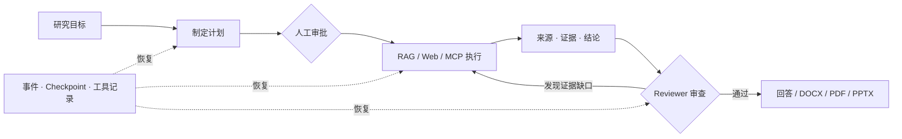

<div align="center">
  

  <h1>EvidentLoop</h1>

  <p><strong>给出答案并不难，难的是让研究过程可追溯、可恢复、可验证。</strong></p>
  <p>一个证据优先的持久化 AI 研究工作台，将开放问题转化为可核验结论与可直接使用的专业文稿。</p>

  <p>
    
    
    
    
    <a href="./LICENSE"></a>
  </p>

  <p><a href="./README.md">English</a> · <strong>简体中文</strong></p>
</div>

---

EvidentLoop 不是又一个聊天界面，而是一次对“AI 研究系统如何越过 Demo 阶段”的完整工程实践：任务要能恢复，结论要有证据，工具要受约束，检索要能评测，研究结果还要成为真正可交付的文稿。

## 为什么值得关注

| | 核心能力 | 带来的改变 |
| :---: | --- | --- |
| ↻ | **持久化 Agent Runtime** | 显式状态机、Checkpoint、工具幂等复用、重试、取消与可恢复 SSE，让长任务中断后仍能安全继续。 |
| ⛓ | **Source → Evidence → Claim** | 每条结论都可以回溯到具体来源片段，并标记支持、反驳或背景关系。 |
| ◎ | **可以量化的检索质量** | Dense / Hybrid RAG、置信度驱动的查询改写、拒答用例、历史基线与逐案例回归分析，避免凭感觉调参。 |
| ◈ | **有硬边界的工具系统** | 不可变 Runtime Snapshot、Schema Hash、策略过滤、可用性检查、审批门禁和 MCP 隔离，把权限落实在代码中。 |
| ✦ | **从研究到专业交付物** | 同一套可编辑、可版本化流程生成带引用的 DOCX、PDF 与 PPTX，支持渲染质检、修复重试、预览和跨会话产物库。 |

## 从问题到可审计产物



整个循环是显式的：Planner 定义预期证据，工具在冻结的权限快照内执行，Reviewer 识别缺少支撑的结论，最终再由 Writer 生成结果。关键约束由运行时代码执行，而不只是写在 Prompt 里。

## 产品能力

### 研究工作台

一个支持流式交互和多轮研究的证据工作区，整合对话历史、实时执行时间线、来源检查、笔记、工具审批、官方研究技能和上下文压缩过程。研究任务在后台持续运行，浏览器连接中断后可以自动恢复。

### Durable Agent Task

针对更长的任务，EvidentLoop 展示完整执行生命周期：规划、审批、步骤依赖、执行次数、Reviewer 审查、证据缺口、Checkpoint、取消和最终报告。已经完成的工具调用会用稳定执行键持久化，恢复时可以安全复用，避免重复产生副作用。

### 知识库与 RAG 实验室

- 导入 Markdown、TXT、DOCX 和文本型 PDF，同时保留标题结构、页码或原文行号定位。
- 支持 Dense / Hybrid 检索、FTS5 + Qdrant、RRF 融合、相邻 Chunk 组装、置信度判断和有预算的查询改写。
- 在真实生产检索链路上计算文件级、章节级和证据级 Recall@3 / MRR@3，覆盖可回答与拒答场景，并支持历史基线和逐问题对比。

### 受控联网证据检索

联网能力不是一次裸 Search API 调用，而是一条有预算的证据流水线：识别查询意图、优先权威域名、改写弱查询、评估页面质量、控制来源多样性、计算 Claim Coverage，并在证据充分时提前停止；证据不足时明确暴露边界。

### 动态工具与 MCP

内置工具和 MCP 工具共享一套中立 Runtime 契约。每一轮模型调用都会获得不可变工具快照；真正执行前再次校验授权、当前可用性、定义 Hash 和输入 Schema。系统支持 Streamable HTTP、本地 stdio、静态 Headers、OAuth、Schema 持久化、显式审批和一键启用的托管预设，同时不会让 MCP 细节侵入研究领域代码。

### 文稿工作台

研究结果可以通过统一生命周期变成演示文稿或长篇文档：创建草稿、编辑、自动保存、确认格式、冻结不可变版本、渲染、检查、修复、预览和下载。DOCX 与 PDF 共用一份长文内容源；PPTX 使用独立的演示模型，但与报告共享引用和研究快照。

## 用数据验证质量

> **119 条黄金问题** · **97.2% 文件级 Recall@3** · **78 个测试文件**

检索改动通过固定语料验证，而不是依赖主观感受。评测集包含 109 条可回答问题和 10 条刻意设计的不可回答问题，从文件、章节和证据三个层级衡量结果，并保留历史基线用于回归分析。项目测试还覆盖 Runtime 恢复、证据链构建、工具安全、MCP 生命周期、流式恢复和文稿生成。

这些数字只描述仓库内固定语料与对应配置，不代表通用模型质量。详细用例与对比方法见 [RAG 检索评测](./docs/development/rag-evaluation.md)。

## 系统架构

```text
Vue 3 工作区
  ├─ 研究工作台           ├─ Durable Task 控制台
  ├─ 知识库与评测实验室   ├─ 跨会话产物库
  └─ MCP 管理             └─ 系统设置
               │ HTTP + 可恢复 SSE
               ▼
Express 协议适配层
               ▼
模块应用层 API
  ├─ Research      ├─ Tasks       └─ Artifacts
               ▼
领域服务与中立契约
  ├─ Agent Loop    ├─ Durable Runtime  ├─ Context
  ├─ RAG / Web     ├─ Evidence Chain   ├─ ToolRuntime
  └─ Skills        └─ Document Model   └─ Approvals
               ▼
基础设施适配器
  ├─ SQLite / Drizzle  ├─ Qdrant / FTS5
  ├─ LLM Provider      ├─ MCP SDK
  └─ DOCX / PDF / PPTX Renderer
```

后端采用模块化单体，并保留唯一生产组合根。Route 只处理协议，Module 暴露应用用例，领域代码依赖中立契约，Provider 实现对应端口；自动化边界测试持续保护依赖方向。

## 技术栈

| 分层 | 技术 |
| --- | --- |
| 前端 | Vue 3、TypeScript、Vite、Tailwind CSS、Reka UI、VueUse |
| 后端 | Node.js、Express、TypeScript、Zod、Drizzle ORM |
| 存储 | SQLite、Qdrant、SQLite FTS5、持久化文件存储 |
| Agent Runtime | Function Calling、可恢复 SSE、Checkpoint、审批管理、上下文压缩 |
| 检索 | Dense Embedding、Hybrid RAG、RRF 融合、Query Rewrite、检索评测 |
| 扩展 | Model Context Protocol、Streamable HTTP、stdio、OAuth、动态工具快照 |
| 文稿 | DOCX、PDF、PPTX、Playwright、PptxGenJS |
| 质量 | Node Test Runner、`tsx`、TypeScript 检查、Runtime 不变量验证 |

## 仓库导览

```text
evident-loop/
├── frontend/                    # Vue 研究工作区
├── backend/src/
│   ├── runtime/                 # 状态机、恢复与证据链
│   ├── research/ + context/     # 流式研究与上下文生命周期
│   ├── rag/ + web/              # 本地知识与联网证据检索
│   ├── tools/ + mcp/            # 工具 Runtime、策略与 MCP 连接
│   ├── artifacts/ + documents/  # 草稿、渲染、质检与持久化
│   └── modules/                 # 对外应用层边界
├── packages/stream-protocol/    # 前后端共享流式协议
├── docs/development/            # 架构与实现文档
└── docs/knowledge/              # 固定评测语料
```

## 适用边界

EvidentLoop 面向可信的本地或私有环境。公网多用户部署还需要外部认证、租户隔离、速率限制与生产级网络安全加固。扫描型 PDF OCR，以及文档中未列出的办公格式导入，不在当前能力范围内。

## License

EvidentLoop 基于 [Apache License 2.0](./LICENSE) 开源。
