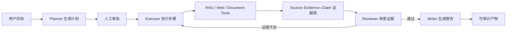

<div align="center">
  

  [English](./README.md) · 中文
</div>

# EvidentLoop（开发中）

An evidence-first durable research agent.

一个面向研究任务的可恢复、可审计、可评测 Agent。

项目正在快速开发，接口、数据结构和交互方式可能调整。目前重点不是继续堆叠聊天功能，而是把 Durable Runtime、Source–Evidence–Claim 证据链、受控检索和可复现评测做扎实。

欢迎通过 Issue、Pull Request 和设计讨论参与共创。本 README 同时作为项目说明和贡献指南。

## 项目状态

当前版本适合本地开发、架构学习和功能演示，尚未达到公网生产部署标准。

已经实现：

- 多轮 Function Calling Agent Loop
- 任务规划、人工审批、显式状态机和 Checkpoint
- 工具执行记录、幂等复用和失败重试
- Source–Evidence–Claim 证据链
- Reviewer 驱动的证据缺口识别与一次受控补充检索
- 多格式知识库（Markdown / TXT / DOCX / 文本型 PDF）、结构感知分块、页码或原文行号引用，以及 Dense/Hybrid RAG 和查询改写
- Recall@K、MRR、拒答能力等 RAG 评测
- 可断线重连、支持显式停止的后台研究工作台，以及任务控制台和 Word 报告生成

正在开发或尚未完成：

- `maxTokens` 已进入任务约束，但尚未完成真实 Token 统计与强制预算控制
- LLM 和 Embedding Provider 仍需要进一步解耦
- API 暂无认证、用户隔离和速率限制
- `fetch_page` 等联网工具仍需生产级 SSRF 加固
- 扫描 PDF OCR、XLSX/CSV/PPTX 导入和 PDF 视觉版面重建尚未实现
- 前端自动化测试和端到端测试覆盖不足
- 多实例任务锁、队列调度和完整 Run Replay 尚未实现

请不要在介绍、简历或文章中把尚未完成的能力描述为已经实现。

## 核心工作流



项目遵循几个基本原则：

- 约束应该由运行时代码执行，不能只写在 Prompt 中。
- 证据不足时应明确说明限制，不能让模型补写不存在的来源。
- 检索改动应通过固定评测集验证，不能只依赖主观体验。
- 对长任务保留状态、事件和工具结果，使失败后能够判断哪些工作可以安全复用。
- 优先保持核心实现可理解，再考虑引入大型 Agent 框架。

## 快速启动

环境要求：

- Node.js 20+
- pnpm 10+
- Docker 与 Docker Compose
- DeepSeek 或 MiniMax API Key
- 支持 OpenAI Embeddings 协议的 Embedding API Key

```bash
pnpm install
cp backend/.env.example backend/.env
pnpm qdrant:up
pnpm dev
```

启动前编辑 `backend/.env`，选择一个文本模型 Provider，并填写 Embedding Key。DeepSeek 示例：

```dotenv
DEEPSEEK_API_KEY=你的_DeepSeek_Key
EMBEDDING_API_KEY=你的_Embedding_Key
```

MiniMax 示例：

```dotenv
LLM_PROVIDER=minimax
MINIMAX_API_KEY=你的_MiniMax_Key
MINIMAX_MODEL=MiniMax-M3
MINIMAX_BASE_URL=https://api.minimaxi.com/v1
EMBEDDING_API_KEY=你的_Embedding_Key
```

如果需要使用联网搜索工具，还需配置：

```dotenv
TAVILY_API_KEY=你的_Tavily_Key
```

访问地址：

- 前端：http://localhost:5173
- 后端健康检查：http://localhost:3000/api/health
- Qdrant 控制台：http://localhost:6333/dashboard

首次启动后，可在“知识库”页面上传文件，并保持“保存后自动向量化”开启。当前支持 `.md`、`.txt`、`.docx` 和文本型 `.pdf`。`knowledge-samples/` 仍提供 Markdown 示例；导入的 PDF/DOCX 只读，可下载原件或重新解析。扫描件或无法抽出文本的 PDF 会被拒绝，不会写入空内容。

完整的环境变量、首次初始化、功能验收和故障排查见 [运行指南](./RUNNING.md)。

## 项目结构

```text
.
├── frontend/                   # Vue 3 + Vite + TypeScript
├── backend/                    # Express + TypeScript + SQLite
│   └── src/
│       ├── modules/            # 模块应用层入口与边界
│       ├── llm/                # LLM Provider 端口与适配器
│       ├── agent/              # Function Calling Agent Loop
│       ├── runtime/            # 状态机、Checkpoint、证据链和任务执行
│       ├── knowledge/          # 多格式导入、解析器、原件存储和来源定位
│       ├── rag/                # Chunk、检索、融合、改写和评测
│       ├── tools/              # 工具契约、能力目录与组合注册
│       └── documents/          # Word 文档 Schema 与渲染
├── docs/knowledge/             # 内置评测和演示知识文档
├── knowledge-samples/          # 可导入知识库的示例资料
├── docker-compose.yml          # 本地 Qdrant
└── RUNNING.md                  # 完整运行指南
```

后端模块依赖方向和新增 Provider/Tool 的约定见 [模块化架构约定](./docs/development/modular-architecture.md)。

## 如何参与共创

### 适合贡献的方向

优先欢迎以下类型的贡献：

| 方向          | 示例                                                  |
| ------------- | ----------------------------------------------------- |
| Runtime       | Token/成本/时间预算、恢复语义、并发任务锁、Run Replay |
| Agent Loop    | 上下文管理、错误恢复、工具调用协议兼容、流式事件      |
| RAG           | Reranker、检索评测用例、置信度校准、查询融合          |
| Provider      | LLM Provider、Embedding Provider、兼容 API 适配       |
| Tool Safety   | Zod 参数校验、权限策略、超时、SSRF 防护               |
| Frontend      | 任务可观测性、证据链展示、错误反馈、端到端测试        |
| Documentation | 架构说明、复现实验、英文文档、运行排错                |

第一次参与时，可以从文档、测试、配置校验或小范围 UI 问题开始。涉及 Runtime 状态、数据库结构、工具权限或 Provider 抽象的大改动，建议先创建 Issue 讨论方案。

### 开始开发

1. Fork 仓库并从最新主分支创建功能分支。
2. 在 Issue 中说明要解决的问题、预期行为和验证方式。
3. 保持一次 Pull Request 只解决一个主题。
4. 修改实现时同步补充或更新测试。
5. 如果改变配置、接口或用户操作方式，同步更新 README 或 `RUNNING.md`。
6. 提交 Pull Request，并说明改动、设计取舍、验证结果和已知限制。

小型修复可以直接提交 Pull Request；架构调整请先讨论，避免贡献者投入大量工作后才发现方向不一致。

### 本地验证

提交前至少执行：

```bash
pnpm typecheck
pnpm test
pnpm --filter backend runtime:verify
pnpm build
```

依赖变更还应执行：

```bash
pnpm install --frozen-lockfile
pnpm audit --registry=https://registry.npmjs.org/ --prod
```

当前根目录的 `pnpm lint` 只是预留入口，尚未接入正式 Lint 工具，不能代替类型检查和测试。

### Pull Request 检查清单

- [ ] 改动目标清晰，没有混入无关重构
- [ ] TypeScript 类型检查通过
- [ ] 现有自动化测试通过
- [ ] 新行为包含对应测试或说明无法自动测试的原因
- [ ] 前端变化附带截图或录屏
- [ ] 配置、接口或运行方式变化已更新文档
- [ ] 没有提交 `.env`、API Key、数据库、生成文件或个人 IDE 配置
- [ ] 没有把尚未实现或未经评测的能力描述为完成
- [ ] 已说明兼容性影响、数据迁移需求和已知限制

## Issue 建议格式

为了让问题更容易复现和认领，Issue 建议包含：

- 问题背景和使用场景
- 当前行为与期望行为
- 最小复现步骤
- Node.js、pnpm、操作系统和相关服务版本
- 错误日志或界面截图，注意删除密钥和个人数据
- 如果是功能提案，说明为什么适合进入项目核心，而不是业务定制

可以在标题前使用 `[Runtime]`、`[RAG]`、`[Frontend]`、`[Tool]`、`[Docs]` 等模块标记。

## 数据与安全

- SQLite 数据、会话、任务和生成文档默认写入 `backend/data/`。
- 导入的知识库原件默认写入 `backend/data/knowledge-files/`。
- Qdrant 保存派生向量和来源元数据，数据位于本地 Docker volume。
- `.env`、数据库、构建产物和本地配置禁止提交。
- 示例配置只能保留空值或无效占位值，禁止放入真实密钥。
- 当前 API 没有认证和限流，请不要把开发服务器直接暴露到公网。
- 提交日志、截图或 Issue 前，请检查是否包含对话数据、文档内容、Token 或内部地址。

## 常用命令

```bash
pnpm dev                 # 同时启动前后端
pnpm typecheck           # TypeScript 检查
pnpm test                # 自动化测试
pnpm build               # 生产构建检查
pnpm qdrant:up           # 启动 Qdrant
pnpm qdrant:down         # 停止 Qdrant，保留数据卷
pnpm rag:sync            # 重建或同步知识库索引
pnpm rag:eval            # 执行真实检索链路评测
pnpm rag:eval:smoke      # 执行不依赖外部 Embedding 的冒烟评测
```

## 贡献目标

这个项目不追求最快堆出最多功能，而是希望形成一个能够回答以下问题的参考实现：

- Agent 中断后，系统如何知道从哪里继续？
- 工具已经成功但请求断开时，如何避免重复执行？
- 一条结论如何追溯到具体来源和证据？
- Reviewer 发现证据不足后，如何进行有预算的补充检索？
- RAG 优化如何通过固定数据集证明没有回退？
- 模型、工具和运行时之间的职责边界应该放在哪里？

如果你的贡献能让这些问题更清晰、更可靠或更容易复现，它就非常适合这个项目。

## License

EvidentLoop 使用 [Apache License 2.0](./LICENSE) 开源。
