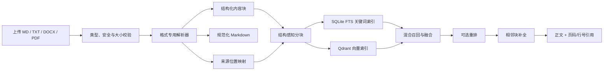

# 知识库多格式文件导入与高质量检索技术方案

> 状态：待实施  
> 目标版本：V1  
> 面向对象：负责后端、RAG、数据库和前端实现的 Agent / 工程师  
> 适用仓库：Evident Loop

## 1. 背景

当前知识库只支持 Markdown：

- 前端只允许选择 `.md` 文件，并使用 `File.text()` 在浏览器读取。
- 后端通过 JSON 接收 `path + content`，没有二进制文件上传接口。
- SQLite 的 `knowledge_documents` 只保存路径和 Markdown 文本。
- `resolveKnowledgePath()` 明确拒绝非 `.md` 文件。
- RAG 分块器依赖 Markdown 标题、表格和代码块结构。
- 检索结果引用位置只有 Markdown 行号。

目标是在不破坏现有 Markdown 文档、检索工具和评测链路的前提下，支持导入其他常见知识文件，并尽量保留原始结构和准确引用位置。

## 2. 设计结论

不要把所有文件简单转换成一整段 Markdown 后丢弃原始结构。

采用三层内容模型：

1. **原始文件**：用于下载、审计和重新解析。
2. **结构化内容块**：标题、段落、列表、表格、代码及来源位置，是分块和检索的事实来源。
3. **规范化 Markdown**：用于界面预览、全文工具读取以及最终发送给模型。



## 3. V1 范围

### 3.1 支持格式

| 格式 | V1 行为 | 引用位置 |
|---|---|---|
| Markdown `.md` | 保留现有手动创建、编辑和导入能力 | 行号 |
| TXT `.txt` | UTF-8 文本，按段落解析 | 原始行号 |
| DOCX `.docx` | 提取标题、段落、列表和表格 | 规范化文本行号、标题路径 |
| 文本型 PDF `.pdf` | 按页提取文本并保留页码 | 页码范围 |

### 3.2 V1 不包含

- 扫描 PDF OCR。
- 图片 OCR 和图片语义理解。
- XLSX、CSV 和 PPTX。
- DOCX 图片、批注、修订记录和复杂浮动布局还原。
- PDF 视觉版面重建。
- 强制依赖外部重排服务。

扫描 PDF 必须返回明确错误，不允许把空文本或乱码写入知识库。

## 4. 核心原则

1. **向后兼容**：已有 Markdown 文档无需重新导入。
2. **解析与索引解耦**：文档保存成功后，即使 Embedding 或 Qdrant 失败，文档仍然保留并标记为待索引。
3. **格式专用解析**：不同文件不能使用同一个通用纯文本提取器。
4. **结构优先分块**：先尊重标题、段落、表格等边界，再考虑 token 上限。
5. **位置可追溯**：检索结果必须能回到原始页码或行号。
6. **导入文件只读**：PDF、DOCX 等解析后的 Markdown 不允许直接编辑，避免与原件失去对应关系。
7. **可重新解析**：解析器升级后可利用原文件重建内容块和索引。
8. **安全默认**：不信任文件名、扩展名、MIME 或压缩包内容。

## 5. 统一领域模型

建议新增 `backend/src/knowledge/types.ts`：

```ts
export type KnowledgeFormat = 'md' | 'txt' | 'docx' | 'pdf';
export type KnowledgeSourceType = 'manual' | 'imported';
export type KnowledgeBlockType =
  | 'heading'
  | 'paragraph'
  | 'list'
  | 'table'
  | 'code';

export type SourceLocator = {
  normalizedLineStart: number;
  normalizedLineEnd: number;
  originalLineStart?: number;
  originalLineEnd?: number;
  pageStart?: number;
  pageEnd?: number;
};

export type KnowledgeBlock = {
  id: string;
  order: number;
  type: KnowledgeBlockType;
  text: string;
  headingPath: string[];
  locator: SourceLocator;
  metadata: {
    tableHeaders?: string[];
    listLevel?: number;
    language?: string;
  };
};

export type ParsedKnowledgeDocument = {
  title: string;
  format: KnowledgeFormat;
  content: string; // 规范化 Markdown
  blocks: KnowledgeBlock[];
  parserName: string;
  parserVersion: string;
  warnings: string[];
  metadata: {
    pageCount?: number;
    characterCount?: number;
  };
};
```

### 5.1 约束

- `content` 是展示和模型输入格式，不是唯一事实来源。
- 每个结构化块必须拥有确定的 `order` 和 `locator`。
- `headingPath` 保存完整标题祖先，例如 `['市场风险', '利率风险']`。
- 解析器不得把存储路径、随机 UUID、上传时间写入可检索正文。
- `parserVersion` 发生变化后，该文档必须被判定为索引过期。

## 6. 数据库设计

### 6.1 扩展 `knowledge_documents`

保留现有 `path`、`content`、`created_at` 和 `updated_at`，新增：

```sql
source_type          TEXT NOT NULL DEFAULT 'manual'
format               TEXT NOT NULL DEFAULT 'md'
mime_type            TEXT
original_name        TEXT
original_size        INTEGER
storage_key          TEXT
parser_name          TEXT NOT NULL DEFAULT 'markdown'
parser_version       TEXT NOT NULL DEFAULT '1'
parse_warnings_json  TEXT NOT NULL DEFAULT '[]'
metadata_json        TEXT NOT NULL DEFAULT '{}'
content_hash         TEXT
original_hash        TEXT
```

字段含义：

- `path`：知识库中的逻辑路径，继续作为兼容主键。
- `content`：规范化 Markdown。
- `source_type`：`manual` 或 `imported`。
- `format`：`md`、`txt`、`docx` 或 `pdf`。
- `storage_key`：原文件存储键，不对前端公开。
- `content_hash`：规范化内容哈希。
- `original_hash`：原始二进制 SHA-256，用于审计和去重判断。

### 6.2 新增 `knowledge_document_blocks`

```sql
CREATE TABLE knowledge_document_blocks (
  id                  TEXT PRIMARY KEY,
  document_path       TEXT NOT NULL,
  block_order         INTEGER NOT NULL,
  block_type          TEXT NOT NULL,
  text                TEXT NOT NULL,
  heading_path_json   TEXT NOT NULL DEFAULT '[]',
  locator_json        TEXT NOT NULL DEFAULT '{}',
  metadata_json       TEXT NOT NULL DEFAULT '{}',
  FOREIGN KEY (document_path)
    REFERENCES knowledge_documents(path)
    ON DELETE CASCADE
);

CREATE UNIQUE INDEX knowledge_document_blocks_path_order_idx
ON knowledge_document_blocks(document_path, block_order);
```

### 6.3 研究来源位置持久化

当前 `research_sources` 只保存 `start_line` 和 `end_line`。为了让 PDF 页码在刷新后不丢失，新增：

```sql
locator_json TEXT
```

`backend/src/research/store.ts` 写入和读取 `RagSource.locator` 时必须同步该字段。

### 6.4 兼容迁移

仓库当前在 `initDb()` 中以 SQL 初始化数据库，没有独立迁移框架。实现时使用幂等迁移：

1. 创建旧版基础表。
2. 使用 `PRAGMA table_info(knowledge_documents)` 检查新增列。
3. 对缺失列逐一执行 `ALTER TABLE ... ADD COLUMN`。
4. 创建 `knowledge_document_blocks`。
5. 给已有文档补默认值：

```text
source_type = manual
format = md
mime_type = text/markdown
parser_name = legacy-markdown
parser_version = 1
```

6. 旧文档没有结构化块时，首次读取、编辑或同步索引时懒生成块；也可以在启动迁移中批量回填。

迁移必须有独立测试，验证旧数据库升级后文档仍可读取和检索。

## 7. 原文件存储

默认目录：

```text
backend/data/knowledge-files/
```

允许通过环境变量覆盖：

```env
KNOWLEDGE_FILES_DIR=/absolute/path
```

规则：

- 存储文件名使用 UUID，不直接使用用户文件名。
- 示例：`550e8400-e29b-41d4-a716-446655440000.pdf`。
- 数据库单独保存原始文件名。
- 写入临时文件后原子重命名，避免半写入文件。
- 数据库写入失败时清理刚保存的原件。
- 删除文档时清理原件、结构化块、FTS 和 Qdrant 向量。
- 下载接口只能通过数据库解析 `storage_key`，不能接受任意文件系统路径。

如果未来使用对象存储，只需替换 `OriginalFileStore` 接口：

```ts
interface OriginalFileStore {
  save(input: { bytes: Buffer; extension: string }): Promise<string>;
  read(storageKey: string): Promise<Buffer>;
  delete(storageKey: string): Promise<void>;
}
```

## 8. 模块结构

建议新增：

```text
backend/src/knowledge/
├── types.ts
├── importService.ts
├── parserRegistry.ts
├── originalFileStore.ts
├── contentNormalizer.ts
└── parsers/
    ├── markdownParser.ts
    ├── textParser.ts
    ├── docxParser.ts
    └── pdfParser.ts
```

现有相关模块需要调整：

```text
backend/src/routes/knowledge.ts
backend/src/rag/knowledgeFiles.ts
backend/src/rag/types.ts
backend/src/rag/chunker.ts
backend/src/rag/sync.ts
backend/src/rag/vectorStore.ts
backend/src/rag/keywordStore.ts
backend/src/rag/contextAssembly.ts
backend/src/research/store.ts
backend/src/runtime/evidenceChainBuilder.ts
backend/src/schema.ts
backend/src/db.ts
frontend/src/api/knowledge.ts
frontend/src/types/chat.ts
frontend/src/types/research.ts
frontend/src/components/chat/KnowledgeBasePanel.vue
frontend/src/components/chat/AgentThinkingPanel.vue
frontend/src/components/research/ResearchSourcesPanel.vue
```

## 9. 解析器接口

```ts
type KnowledgeUpload = {
  originalName: string;
  mimeType: string;
  size: number;
  buffer: Buffer;
};

interface KnowledgeParser {
  readonly name: string;
  readonly version: string;
  readonly formats: KnowledgeFormat[];
  canParse(input: KnowledgeUpload): boolean;
  parse(input: KnowledgeUpload): Promise<ParsedKnowledgeDocument>;
}
```

`parserRegistry` 根据校验后的真实类型选择解析器，不允许在路由中堆积格式判断。

## 10. 各格式解析要求

### 10.1 Markdown

- 保留标题、段落、列表、表格和围栏代码块。
- 识别完整标题路径。
- 保留规范化行号。
- 手动创建的 Markdown 标记为 `source_type=manual`，允许编辑。
- 上传的 Markdown 可标记为 `imported`，默认只读；也可以在产品层决定上传 Markdown 是否转为可编辑。

### 10.2 TXT

- V1 只接受 UTF-8，可处理 UTF-8 BOM。
- 检测 NUL 字节，疑似二进制内容立即拒绝。
- 按空行切分段落。
- 第一行不是可靠标题时使用文件名作为标题。
- 生成规范化 Markdown 时补充一级标题。
- 保留原始行号映射。

### 10.3 DOCX

推荐依赖：

- `mammoth`：将 DOCX 语义结构转换为 HTML。
- `cheerio`：安全遍历 HTML 并生成结构化块。
- 不应使用正则解析 HTML 表格。

规则：

- Word `Title` 映射为文档一级标题。
- `Heading 1/2/3...` 映射为规范化标题层级。
- 普通段落生成 `paragraph`。
- 有序、无序列表生成 `list` 并保存层级。
- 表格直接从 HTML DOM 生成 `table` 块，同时生成 Markdown 表格预览。
- 第一行作为表头；如果 DOCX 没有显式表头，仍将第一行作为检索语境保存，并产生 warning。
- 嵌入图片 V1 忽略，但产生解析 warning。
- 不允许外部文件访问。
- 校验 DOCX 是合法 ZIP，并至少包含 `[Content_Types].xml` 与 `word/document.xml`。

### 10.4 PDF

推荐依赖：`pdfjs-dist` 的 Node/legacy 构建。

规则：

- 校验文件头 `%PDF-`。
- 逐页读取文本层。
- 每个提取块保留 `pageStart/pageEnd`。
- 合并同一行的文本 item，利用坐标判断换行；不能只依赖 item 顺序。
- 尝试修复行尾连字符断词。
- 统计多页重复的顶部和底部短文本，作为页眉页脚候选移除。
- 不因为换页强行打断明显连续的段落。
- 可在规范化 Markdown 中插入 `## 第 N 页` 作为预览边界，但分块器不能把页标题当成真正业务章节。
- 文本总量低于阈值时判定为扫描 PDF，返回专用错误：

```text
未检测到可提取文本。当前版本暂不支持扫描 PDF OCR。
```

- 加密、损坏或解析失败的 PDF 不入库。
- 多栏和复杂布局可能存在阅读顺序误差，必须在 `warnings` 中提示。

## 11. 文件上传与安全

### 11.1 依赖

可使用：

- `multer`：`multipart/form-data` 内存上传。
- `mammoth`：DOCX。
- `cheerio`：HTML 结构遍历。
- `pdfjs-dist`：PDF 文本层。

### 11.2 限制

建议环境变量：

```env
KNOWLEDGE_MAX_UPLOAD_BYTES=20000000
KNOWLEDGE_MAX_EXTRACTED_BYTES=5000000
KNOWLEDGE_MAX_PDF_PAGES=500
KNOWLEDGE_FILES_DIR=backend/data/knowledge-files
```

必须校验：

- 扩展名。
- 浏览器 MIME，仅作为辅助信息。
- 文件 magic bytes。
- DOCX ZIP 内部关键文件。
- ZIP 解压总大小和压缩比，防止压缩炸弹。
- PDF 页数上限。
- 提取后文本大小。
- 文件名中的 NUL、控制字符、路径分隔符和 `..`。

V1 只允许单文件上传。

## 12. API 设计

### 12.1 上传文件

```http
POST /api/knowledge/documents/upload
Content-Type: multipart/form-data
```

字段：

| 字段 | 类型 | 必填 | 说明 |
|---|---|---|---|
| `file` | File | 是 | MD/TXT/DOCX/PDF |
| `path` | string | 否 | 知识库逻辑路径，默认使用安全化文件名 |
| `autoIndex` | boolean | 否 | 默认 `true` |

成功响应：

```json
{
  "code": 1,
  "message": "Document imported",
  "data": {
    "document": {
      "path": "risk-report.pdf",
      "title": "风险报告",
      "format": "pdf",
      "sourceType": "imported",
      "originalName": "风险报告.pdf",
      "originalSize": 1830294,
      "pageCount": 42,
      "editable": false,
      "parseWarnings": [],
      "lineCount": 1830,
      "sizeBytes": 92401,
      "updatedAt": "2026-08-13T10:00:00.000Z"
    },
    "indexStatus": "indexed",
    "indexResult": {
      "chunkCount": 96,
      "upserted": 96
    }
  }
}
```

解析成功但索引失败：

```json
{
  "code": 1,
  "message": "Document imported; indexing is pending",
  "data": {
    "document": {},
    "indexStatus": "pending",
    "indexError": "Embedding service unavailable"
  }
}
```

不得返回 HTTP 失败并让前端误以为文档没有保存。

### 12.2 下载原文件

```http
GET /api/knowledge/documents/original?path=risk-report.pdf
```

- 仅导入文档可用。
- 使用 `Content-Disposition: attachment`。
- 不向客户端暴露 `storage_key`。

### 12.3 重新解析

```http
POST /api/knowledge/documents/reparse
Content-Type: application/json

{
  "path": "risk-report.pdf",
  "autoIndex": true
}
```

执行：读取原件 → 新解析器解析 → 事务替换文档和结构块 → 索引。

### 12.4 保留现有接口

继续保留：

```http
POST   /api/knowledge/documents
PUT    /api/knowledge/documents
DELETE /api/knowledge/documents
POST   /api/knowledge/documents/chunk
POST   /api/knowledge/documents/vectorize
POST   /api/knowledge/sync
```

约束：

- `POST/PUT /documents` 继续用于手动 Markdown。
- `PUT` 遇到 `editable=false` 返回 `409`。
- 删除接口需要同步处理原文件和两个索引。

### 12.5 建议状态码

| 场景 | 状态码 |
|---|---:|
| 上传并保存成功 | 201 |
| 路径冲突 | 409 |
| 不支持格式 | 415 |
| 文件或提取内容过大 | 413 |
| 损坏、加密、扫描 PDF、空文本 | 422 |
| 文档不存在 | 404 |
| 导入文档不允许编辑 | 409 |
| 解析服务内部异常 | 500 |

## 13. 导入事务与故障语义

推荐顺序：

1. 接收内存文件并完成安全校验。
2. 计算原文件 SHA-256。
3. 完整解析到内存中的 `ParsedKnowledgeDocument`。
4. 将原件写入临时存储。
5. 开启 SQLite 事务：写文档、删除旧块、写新块。
6. 提交事务。
7. 原子发布原文件。
8. 在事务外执行向量和关键词索引。

失败处理：

- 1–3 失败：不产生任何持久化数据。
- 4–6 失败：清理临时原件。
- 8 失败：保留文档，状态为 `pending` 或 `outdated`。
- 重解析失败：保留旧解析结果和旧索引。

不要在解析完成前插入半成品数据库记录。

## 14. 结构感知分块

### 14.1 总体策略

- 目标块大小：约 200–500 tokens。
- 普通文本重叠：约 60 tokens。
- 优先按章节和段落边界分割。
- 表格、代码块尽量保持原子。
- 每个 chunk 携带完整 `headingPath`。
- 每个 chunk 携带合并后的 `locator`。

### 14.2 普通正文

将连续段落打包到 token 上限。如果单段超过上限，再按句子切分；最后才做硬切分。

### 14.3 表格

小表格保持完整。大型表格按行组拆分，每一块重复：

- 文档标题。
- 章节路径。
- 表头。
- 当前行组。

用于 Embedding 的表格记录建议转成语义化文本：

```text
文档：债券持仓
章节：组合风险 > 持仓明细
列：证券名称、评级、久期、DV01

记录：
证券名称：债券 A
评级：AA
久期：5.2
DV01：18500
```

不要把数百行 Markdown 表格作为一个向量。

### 14.4 PDF

- chunk 可跨页，但 `pageStart/pageEnd` 必须准确。
- 页边界不是强制语义边界。
- 最终显示 `第 12 页` 或 `第 12–13 页`。

### 14.5 稳定 ID

chunk ID 不应只依赖行号，避免文档前面插入空行后所有 ID 改变。

建议：

```text
chunkKey = SHA-256(
  documentPath
  + parserVersion
  + headingPath
  + sourceBlockIds
  + sectionOccurrence
  + partIndex
)
```

相邻块关系继续保留：

```text
previousChunkId
nextChunkId
parentId
```

## 15. 索引设计

### 15.1 Embedding 输入

```text
文档：2026 年风险报告
文件类型：PDF
章节：市场风险 > 利率风险
来源：第 12–13 页

久期上升会提高投资组合对利率变动的敏感度……
```

不应加入：

- UUID。
- 物理存储路径。
- 上传时间。
- 文件大小。
- 解析器内部调试信息。

### 15.2 索引指纹

索引是否过期不能只比较 `content`。至少包含：

```text
规范化内容
+ 结构化块及位置
+ parserName/parserVersion
+ chunkerVersion
+ embeddingModel
```

### 15.3 Qdrant payload

在现有 payload 上新增：

```ts
{
  format: 'pdf',
  sourceType: 'imported',
  locator: {
    normalizedLineStart: 120,
    normalizedLineEnd: 138,
    pageStart: 12,
    pageEnd: 13
  },
  parserVersion: 'pdfjs-v1'
}
```

`parsePayload()` 必须兼容旧 payload 没有这些字段的情况。

### 15.4 SQLite FTS

当前 FTS 表结构固定。增加 locator 时建议提升表名版本，例如：

```text
knowledge_chunk_fts_v2
→ knowledge_chunk_fts_v3
```

新增 unindexed 字段：

```text
format
locator_json
parser_version
```

关键词检索返回结果时恢复 locator。

## 16. 检索流程

保留当前混合检索方向：

```text
Dense Top 20
+
Keyword Top 20
→ RRF 融合
→ 单文档结果限流
→ 可选重排 Top 15–20
→ 选取 Top 5–8
→ 相邻块补全
→ 上下文预算裁剪
```

### 16.1 重排

重排作为可选增强，不得阻塞 V1 基础导入：

```env
RAG_RERANK_ENABLED=false
RAG_RERANK_MODEL=
RAG_RERANK_TOP_N=8
```

未配置或调用失败时，回退到当前 RRF 结果。

重排输入包括：

- 用户问题。
- 文档标题。
- 标题路径。
- chunk 正文。
- 文件格式与来源位置。

### 16.2 相邻块补全

当前 `mergeAdjacentChunks()` 可继续使用，但合并后还要：

- 合并页码范围。
- 合并原始行号范围。
- 保留排名最高成员的检索分数。
- 避免一个文档吞掉整个上下文窗口。

## 17. 引用链路

`RagSource` 增加：

```ts
locator?: SourceLocator;
format?: KnowledgeFormat;
```

必须贯穿：

1. chunk。
2. Qdrant payload。
3. FTS 行。
4. `search_knowledge` 返回值。
5. Chat 的来源面板。
6. Research source 持久化。
7. Agent runtime evidence locator。

显示规则：

```ts
if (locator.pageStart) {
  // 第 3 页 / 第 3–4 页
} else if (locator.originalLineStart) {
  // 原文第 12–20 行
} else {
  // 第 12–20 行
}
```

`backend/src/runtime/evidenceChainBuilder.ts` 不应只读取顶层 `startLine/endLine`，还要保留 `result.locator` 中的页码。

## 18. 前端方案

### 18.1 上传入口

知识库顶部保留两个入口：

- `上传文件`：MD、TXT、DOCX、PDF。
- `添加文档`：手动创建 Markdown。

文件选择器：

```html
accept=".md,.txt,.docx,.pdf,text/markdown,text/plain,application/pdf,application/vnd.openxmlformats-officedocument.wordprocessingml.document"
```

不要再用 `File.text()` 处理 DOCX/PDF，统一通过 `FormData` 上传服务端。

### 18.2 文档列表

展示：

- 格式徽标：MD/TXT/DOCX/PDF。
- 索引状态。
- 页数或行数。
- 原文件大小。
- 解析 warning 标识。

### 18.3 文档详情

导入文档提供：

- 规范化 Markdown 预览。
- 切片预览。
- 下载原文件。
- 重新解析。
- 手动向量化。
- 删除。

导入文档不显示编辑按钮，并标记“导入文件 · 提取内容只读”。

### 18.4 切片与引用

- PDF 显示页码而非规范化 Markdown 行号。
- TXT/Markdown 显示行号。
- warning 以非阻断提示展示。

### 18.5 相关类型

同步更新：

- `frontend/src/api/knowledge.ts`
- `frontend/src/types/chat.ts`
- `frontend/src/types/research.ts`

否则即使后端返回页码，Chat 和 Research 仍会只显示行号。

## 19. 错误与文案

建议前端可直接展示的错误：

| 场景 | 文案 |
|---|---|
| 不支持格式 | 支持上传 Markdown、TXT、DOCX 和文本型 PDF。 |
| 文件过大 | 文件不能超过 20 MB。 |
| 空文档 | 文件中没有可导入的文本内容。 |
| 扫描 PDF | 未检测到可提取文本。当前版本暂不支持扫描 PDF OCR。 |
| 加密 PDF | PDF 已加密，请解除密码保护后重新上传。 |
| 损坏 DOCX | 无法读取 Word 文件，请确认文件未损坏。 |
| 同名冲突 | 知识库中已存在同名文件，请修改名称后重试。 |
| 索引失败 | 文件已导入，但索引暂未完成，可稍后手动向量化。 |

## 20. 测试策略

### 20.1 测试夹具

建议目录：

```text
backend/src/knowledge/fixtures/
├── sample.md
├── sample.txt
├── headings-and-table.docx
├── text-layer.pdf
├── two-column.pdf
├── scanned-no-text.pdf
├── encrypted.pdf
├── corrupt.docx
└── fake-extension.pdf
```

只提交体积很小、无版权问题的自生成夹具。

### 20.2 单元测试

解析器：

- Markdown 标题路径、表格和代码块。
- TXT BOM、空行、非法 UTF-8、NUL。
- DOCX 标题、列表、表格、图片 warning。
- PDF 页码、跨页文本、空文本、加密和损坏。
- 文件签名与扩展名不一致。

结构和分块：

- chunk 继承正确 locator。
- 表格分块重复表头。
- PDF 跨页 chunk 合并页码范围。
- parserVersion 或 locator 改变会更新索引指纹。
- 在文档前插入空行不会导致所有稳定 ID 变化。

### 20.3 数据库测试

- 旧版数据库迁移。
- 文档和 blocks 事务写入。
- 删除文档级联删除 blocks。
- 重新解析失败保留旧数据。
- research source locator 可持久化恢复。

### 20.4 API 集成测试

- multipart 上传四种格式。
- 同名冲突。
- 大小限制。
- 下载原文件内容与上传一致。
- 导入文档 PUT 返回 409。
- 上传成功但模拟索引失败时仍返回保存成功。
- 删除后原文件、FTS 和向量清理。

### 20.5 检索质量测试

为每种格式建立相同语义内容的测试文档，比较：

- Recall@5。
- MRR。
- 精确术语和数字命中率。
- PDF 页码准确率。
- DOCX 标题路径准确率。
- 表格问答命中率。
- 无答案误召回率。

现有 Markdown RAG 评测不得出现明显回退。

### 20.6 前端验证

- 四种格式上传交互。
- 导入进度和错误状态。
- 格式、页数、文件大小显示。
- 导入文档无编辑按钮。
- 下载与重新解析。
- PDF 在切片、Chat 来源、Research 来源中均显示页码。

## 21. 可观测性

记录但不写入可检索正文：

- 文件格式与大小。
- 解析器名称和版本。
- 解析时长。
- 页数和结构块数量。
- 提取字符数。
- warning 数量。
- chunk 数量。
- 索引耗时和失败阶段。

日志不得包含完整文档正文。

## 22. 实施拆分

### 阶段 A：数据模型与兼容层

- 新增领域类型。
- 幂等数据库迁移。
- 新增 blocks 表。
- 旧 Markdown 懒回填结构块。
- 保持现有 API 和 RAG 测试通过。

### 阶段 B：导入基础设施

- 原文件存储抽象。
- multipart 上传。
- parser registry。
- MD/TXT 解析器。
- 上传、下载、删除接口。

### 阶段 C：DOCX 与 PDF

- DOCX 结构解析。
- PDF 文本层和页码解析。
- 扫描/加密/损坏文件处理。
- 重新解析接口。

### 阶段 D：索引与引用升级

- 结构感知分块。
- locator 进入 Qdrant 和 FTS。
- 索引指纹升级。
- Chat、Research、runtime evidence 贯穿 locator。

### 阶段 E：前端与质量验证

- 多格式上传和状态展示。
- 导入文档只读详情。
- 下载、重新解析。
- 多格式检索评测。
- 全量类型检查、测试和构建。

每个阶段都应可独立通过类型检查和既有测试，不要一次性改完后再修回归。

## 23. 验收标准

V1 完成必须满足：

1. 能上传 MD、TXT、DOCX 和文本型 PDF。
2. 原文件可下载，内容与上传文件一致。
3. 上传后可查看规范化 Markdown 和切片。
4. DOCX 标题、段落、列表和普通表格可检索。
5. PDF 检索结果显示准确页码。
6. 扫描 PDF、加密 PDF、损坏文件不会生成半成品文档。
7. 导入文档只读，手动 Markdown 仍可编辑。
8. 解析成功但索引失败时文档不丢失。
9. 可从原文件重新解析并刷新索引。
10. 删除文档会清理原件、结构块、FTS 和 Qdrant 数据。
11. 已有 Markdown 无需重新导入。
12. 现有 Markdown 检索评测无明显回退。
13. 后端和前端类型检查、测试、构建全部通过。

## 24. 建议验证命令

```bash
pnpm --filter backend typecheck
pnpm --filter frontend typecheck
pnpm --filter backend test
pnpm --filter frontend test
pnpm --filter backend build
pnpm --filter frontend build
```

如测试共用同一个 SQLite 文件导致并发锁冲突，应为知识库集成测试配置独立的临时 `SQLITE_DB_PATH`，不要通过放宽业务事务语义规避测试问题。

## 25. 实现注意事项

- 不要只修改前端 `accept` 和后端扩展名校验。
- 不要把 DOCX/PDF 二进制放进 JSON 或 SQLite 文本列。
- 不要使用正则作为正式 HTML/OOXML 结构解析器。
- 不要在解析失败后仍保存空文档。
- 不要因为 Embedding 失败回滚已成功解析的文档。
- 不要只在切片预览返回 locator；它必须贯穿正式检索结果。
- 不要只改 Qdrant 而忘记 SQLite FTS。
- 不要只改 Chat 来源面板而忘记 Research 和 runtime evidence。
- 不要把 PDF 页标题当作业务章节参与查询改写主题目录。
- 不要把 parser warning 混入 Embedding 正文。

## 26. 执行前审计

执行 Agent 开始工作前应先运行：

```bash
git status --short
git diff -- backend/src/routes/knowledge.ts backend/src/rag frontend/src/api/knowledge.ts frontend/src/components/chat/KnowledgeBasePanel.vue
```

如果工作区中已经存在未完成的多格式知识库试验代码，应先逐项判断是否符合本文档，不要默认它已完成或可直接合并。尤其检查：

- 数据库迁移执行顺序是否正确。
- DOCX 表格是否使用 DOM 解析。
- PDF 页码 locator 是否贯穿正式检索结果。
- Research 来源刷新后是否保留页码。
- 上传保存成功、索引失败的响应语义是否正确。
- 删除和重解析是否具备失败恢复。

